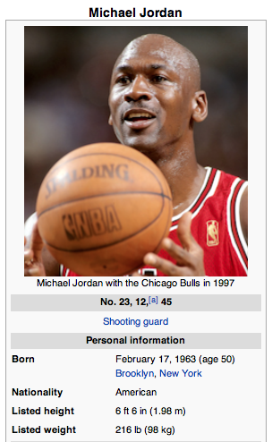

# A Human-Friendly API for Wikipedia

**Motivation:** There's a lot of information on Wikipedia, and people want to use it. Sometimes, these people are programmers; and sometimes, their customers aren't computers.

I needed to parse some information from Wikipedia programatically and present it in a human-readable format, i.e., for clients. I found that a bunch of other people had similar issues (e.g., [here](http://stackoverflow.com/questions/120061/fetch-a-wikipedia-article-with-python?lq=1) and [here](http://stackoverflow.com/questions/4452102/how-to-get-plain-text-out-of-wikipedia?rq=1)), so I've [open-sourced my solution](https://github.com/crm416/quizzler/blob/master/src/wiki.py).

<!--break-->

_Note: this module is currently housed within a larger project; I'll be writing more on that later._

How It Works

To start, we need to understand the current Wikipedia API, the so-called *MediaWiki API*. The [documentation](http://www.mediawiki.org/wiki/API:Main_page) is fairly comprehensive, although it's not easy to find what you're looking for in those dense pages.

The MediaWiki API returns a JSON (or XML, etc.) response with the information you've queried. But the response is pretty cryptic: to get the *actual* information you're looking for, you need to access the proper keys and work some other magic.

For example, here's the beginning of the JSON response for [Michael Jordan's Wikipedia page](http://en.wikipedia.org/wiki/Michael_Jordan):

```json
[
    [
        "parse",
        {
            "text": {
                "*": "<div class=\"dablink\">For other people named Michael Jordan, see <a href=\"/wiki/Michael_Jordan_(disambiguation)\" title=\"Michael Jordan (disambiguation)\">Michael Jordan (disambiguation)</a>.</div>\n<div class=\"metadata topicon nopopups\"..."
            },
            "title": "Michael Jordan"
        }
    ]
]
```

Note that the text itself is also still in HTML.

The methods in *wikipedia.py* are designed to extract the information (i.e., the "*" field above) and parse the HTML, with some help from the *HTMLParser* library. In the above case, our method looks something like this:

```python
return cleanHTMLSection(cleanWikiSection(json_response[0][1][u'text'][u'*']))
```

Where *cleanWikiSection* is reponsible for removing extraneous information from the page itself, and *cleanHTMLSection* is responsible for converting the HTML to plaintext.

BeautifulSoup: Traversing the Parse Tree

In some cases, *wikipedia.py* also uses BeautifulSoup to explore the target page. For example, say we want to extract information from the table below (again, from Michael Jordan's Wikipedia page.)



We do some fairly low-level searching in the table to check every row and extract information based on the row's content formatting. At this point, *wikipedia.py* can extract rows with one-to-one (e.g., "Nationality: American") and one-to-many (e.g., "Career highlights and awards: 6x NBA Champion...") formats.

The output for MJ's table is as follows:

```python
[('Born', 'February 17, 1963'), ('Nationality', 'American'), ('Listed height', '6ft6in'), ('Listed weight', '216lb'), ('High school', 'Emsley A. Laney'), ('College', 'North Carolina'), ('NBA Draft', '1984 / Round: 1 / Pick: 3rd overall'), ...]
```

In Conclusion

Feel free to fork, comment, criticise, or (best of all) get in touch. This was created as a sub-project and is by no means perfect, but I certainly hope it can be useful to some.
