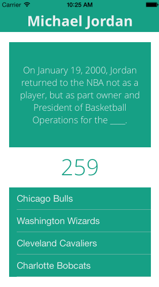

# Quizzler

Update: Quizzler was built as my entry into the Facebook Summer of Hack Hackathon in August 2013 and was selected as the winning hack. Thanks to Facebook for hosting a great event.

After playing a number of poorly-made iPhone quiz games, I decided to roll my own. But I didn't want to spend time creating my own corpus of questions. Thus, Quizzler was born, an attempt to build an iPhone quiz app that generates its own questions.

<!--break-->

_Credit to [Karen Dessire](http://dribbble.com/hrtislove) for the [Playing With Science](http://dribbble.com/shots/921928-Playing-With-Science?list=users) icons on the home screen!_

The technical challenges around such a goal are numerous:

1. Identify factual statements that could be morphed into good questions.
2. Identify keywords in those statements that could be considered an 'answer'.
3. Identify replacement keywords that fix into the same context (as suggested answers).

On the practical level, Quizzler allows users to specify any (reasonable) topic and iterate through questions relevant to that topic. Users can then re-play and attempt more questions for the same topic, or switch topics at any time.

In terms of technical complexity, Quizzler consists of two major components:

1. A Django server, hosted on Heroku, that handles requests for a given topic (with some associated parameters, e.g., number of questions desired). This server hosts all the code to perform NLP on information drawn from the semantics of the web.
2. An iOS app, meant as a user-facing portal to the Django server.

Here's the app in action:

And, at the end of the session, here's the results screen:

