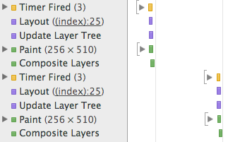
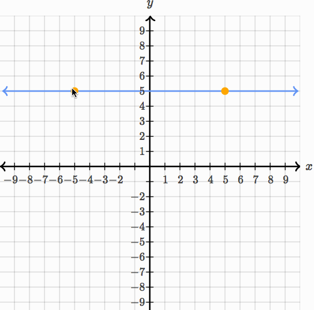
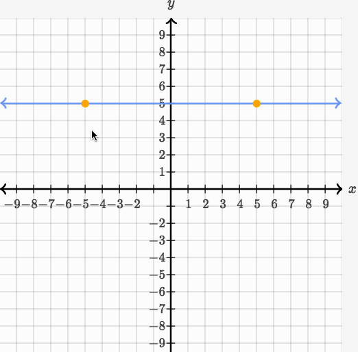

# (More Than) Doubling SVG FPS Rates at Khan Academy

At Khan Academy, we put a lot of effort into producing interactive math content (e.g., [Drawing Polygons](https://www.khanacademy.org/math/basic-geo/basic-geo-coordinate-plane/basic-geo-shapes-on-a-plane/e/drawing-polygons)).

This kind of interaction is particularly important on touch devices: we believe that the mobile experience can _exceed_ that of the desktop in its own way, but much of that belief centers on the value we place in interactivity. To create an engaging mobile experience, we strike to provide interactive content that feels effortless and fun—content with as tight of a feedback loop as we can provide, giving the illusion of complete control, or even _magic_.

Poor performance kills this illusion: if a user drags his or her finger across the screen and the polygon lags behind noticeably, the interaction becomes a chore. The shapes feel heavy and the magic is absent.

So, when we recently discovered that many of our interactive exercises run at rates **as low as 12 FPS** on tablet devices, it was pretty startlingly.

(You might ask: why was this a _recent_ discovery? For one, it's easy to hit 60 FPS on a MacBook Pro, but much harder to do so on a resource-constrained tablet. Thus, our poor perf wasn't apparent on desktop machines. "Discovery" is probably a misnomer; we've just been focusing far more on mobile lately for a number of reasons.)

For our Khan Academy Hack Week, I spent a few days addressing this problem and was able to get most of our interactive exercises up to 55-60 FPS on an iPad. That's a 2-5x speedup (depending on which exercise you're profiling) for a week of work.

## Benchmarks

Lets first lay out some benchmarks and background.

On the most recent iPad Mini (with a retina display), I clocked the following FPS numbers for our interactive exercises using [Instruments](https://developer.apple.com/library/mac/documentation/developertools/conceptual/instrumentsuserguide/MeasuringGraphicsPerformanceinYouriOSDevice/MeasuringGraphicsPerformanceinYouriOSDevice.html) on OS X. For each shape mentioned below, I had it follow my finger's touch around the canvas (as in [Drawing Polygons](https://www.khanacademy.org/math/basic-geo/basic-geo-coordinate-plane/basic-geo-shapes-on-a-plane/e/drawing-polygons)) at maximum speed:

- Multiple points on graph: 35-45 FPS
- Line segments: 16-20 FPS
- Lines: 12 FPS
- Polygons: 16-20 FPS

Yikes. For reference, humans can't really perceive any difference in frame rates about 60 FPS; 10 FPS, on the other hand, feels like slogging through tar, even to the most untrained eye.

In addition, it's worth noting that our existing implementation used SVG (with [Raphael](raphaeljs.com)) for all of our interactive content.

## How Browsers Work

(If you're doing _any_ perf-related front-end work, I highly recommend you read [High Performance Animations](http://www.html5rocks.com/en/tutorials/speed/high-performance-animations/) by Paul Lewis and Paul Irish. Below, I'll be referencing the concepts described in this article.)

Let's talk about how browsers work (for, like, 100 words, I promise). There are four key styles that a browser can animate cheaply:

- Translation, i.e., `transform: translate`
- Scale, i.e., `transform: scales`
- Rotation, i.e., `transform: rotate`
- Opacity

Often, changing node styles requires the browser to perform some expensive tasks. For example, changing the `width` of an element may affect the layout of the page, so the browser has to recompute layout, while changing the `background-color` of an element requires that the element's pixels be repainted.

Sticking to the four properties above (i.e., linear transformations and opacity) lets the browser avoid these expensive tasks and instead merely move existing, painted pixels around the screen.

## The Problem With SVG

To achieve silky-smooth animation, then, you should obviously stick to these properties. And we generally do so at Khan Academy (with a few exceptions).

However, **SVG doesn't provide these same performance guarantees**. In other words, applying linear transformations to SVG elements in the DOM _does_ trigger re-layout and re-painting (by this, I mean using the SVG <transform> attribute, which has a slightly different API than the CSS transform style).

Just take a look at [this Fiddle](http://jsfiddle.net/to83thbt/), which produces the following timeline in DevTools. Notice that purple layout events followed by green re-paints.



_(Aside: This came as something of a shock to me (maybe it shouldn't have, given that SVG is, at its core, just a file format). When I spoke with Paul Irish the other day, he said that there wasn't any particular reason why SVG nodes had to behave differently than DOM nodes in this regard, but that most browsers didn't have particularly good SVG implementations at the moment.)_

In simplest terms: while we'd like our machine to do no more than shift pixels around, SVGs require expensive re-computation and re-painting that leads to a sub-par experience on a resource-constrained device.

## Exploiting CSS Transforms

During our perf profiling, my colleague Aria Toole had a great idea: Why don't we just wrap each individual SVG element in its own DOM node? Then, when we need to transform the underlying SVG, we can just apply an analogous transform to the outer DOM node.

### Wrapping

In effect, Aria was proposing that we go from:

```html
<svg>
  <circle fill="red" transform="translate(2px, 3px)"></circle>
  <circle fill="blue" transform="scale(2)"></circle>
</svg>
```

To:

```html
<div style="transform:translate(2px, 3px)">
  <svg>
    <circle fill="red"></circle>
  </svg>
</div>
<div style="transform:scale(2)">
  <svg>
    <circle fill="blue"></circle>
  </svg>
</div>
```

Under this scheme, we regain all the benefits of cheap animation: as the browser is merely applying linear transforms to vanilla DOM nodes, there's no layout or paint required. Better yet: [CSS Transforms are GPU accelerated](http://www.html5rocks.com/en/tutorials/speed/html5/), making for an even smoother experience.

### Implementation Details

The bulk of the work was in adding an additional layer of abstraction on top of our existing graphing code, largely to handle the disparity between interacting with the outer DOM node and the underlying SVG element. For example, while you want transforms to be applied to the outer DOM node, other attribute changes (e.g., changing a circle from red to blue) should be propagated to the underlying SVG element.

In addition, we were often animating our SVGs with non-transform styles, e.g., setting the center coordinate (`cx` and `cy`) for a `<circle>` rather than applying a transform, or cutting off a `<line>` at the boundaries of the graph by setting its `clip-rect` property. All of these inefficiencies had to go.

As an even more extreme example, we were drawing the tips (or arrows) of our lines by throwing an SVG `<path>` into the DOM and, when the line moved, removing that node from the DOM and replacing it with a new `<path>`. This was super inefficient, and my re-write instead re-used the existing DOM node, moving it with transformations, rather than complete replacement.

In general, this was a process of removing jank from our existing graphing code and deconstructing all of our animation into simple linear transforms—and doing so with as few hacks as possible, given that I wanted this to ship eventually.

## The Gory Bits

Along with these major changes, there were a few more minor pain-points in the implementation. I'll go over them pretty quickly:

### Handling the asymmetry between the SVG and CSS transform APIs.

For example, SVG transforms are unit-less, while CSS transforms _require_ units (e.g., `transform="translate(4, 5)"` vs. `transform="translate(4px, 5px)"`.

### Replacing \<path\> elements.

`<path>` elements couldn't be scaled and rotated in the same way for a number of reasons (aspect ratios would get all messed), but they could be _translated_ with ease. We use paths heavily in our polygon implementation, which draws the boundary and interior with an SVG `<path>`. There are two key interactions involving polygons: (1) clicking and dragging on the interior to translate the polygon, and (2) clicking and dragging on a vertex to manipulate the polygon's core shape. My first change was to replace the polygon's boundary with a set of `<line>` elements which could be easily transformed. Then, I had our DOM-node-wrapped `<path>` elements detect whether a provided transform was a translation, and, if so, merely translate the DOM nodes (and completely re-drawing itself for non-translations). This gave us excellent performance for interaction (1), but sub-par perf for (2). Luckily for us, the interior of the polygon is completely opaque in (2)—why animate what the user can't see? Instead of transforming the interior path onMove, I instead had the path re-draw only onMoveEnd. Major hacks, but the payoff was real.

### Maintaining origin.

In order to avoid clipping, we couldn't have the outer `<div>` hug too tightly to the underlying `<svg>`. Thus, I had to add some padding to the outer `<div>`. This had the unfortunate effect of messing up the origin for transforms, so rotations and scaling transformations caused unexpected behavior. Taking some care to set the `transform-origin` of the outer `<div>` preserved the abstraction.

## The Results

Recall the benchmarks I introduced earlier:

- Multiple points on graph: 35-45 FPS
- Line segments: 16-20 FPS
- Lines: 12 FPS
- Polygons: 16-20 FPS

After introducing the changes above, I was able to present the following numbers during my Hack Week demo:

- Multiple points on graph: **52-60** FPS
- Line segments: **48-58** FPS
- Lines: **52-60** FPS
- Polygons: **55** FPS

That's more like it.

To further hammer home the difference, check out these GIFs, taken in Chrome with "Show paint rectangles" enabled. First, in our previous implementation (note that the green rectangles indicate re-painting activity required by the browser):



And with these improvements, the green rectangles disappear:



## The Future

My hope it that, at some point in this post, you asked yourself: "Why don't you just re-write all of your graphing tools to use HTML5 Canvas or WebGL?" Because that would be a great question! Moving to more performant animation tools is certainly on our road map, but it's more of a several-month project, whereas my goal here was to get some immediate benefit and touch as little of the codebase as possible.

That said, we've already started to plan out the future of our interactive tools, and it's looking likely that we'll end up using [Three.js](http://threejs.org/) or [Mathbox](http://acko.net/blog/making-mathbox/)—after you've seen [How to Fold a Julia Fractal](http://acko.net/blog/how-to-fold-a-julia-fractal/), you almost have to use the technology.

In addition, I'd note that this technique doesn't cover _all_ of our interactive exercises. For example, you can't really cover parabolas or sinusoids under this scheme without distorting the lines in unacceptable ways. Moving over to WebGL would provide a more universal (and less hacky) solution.

In the meantime, though, we'll be putting my hacks through code review and bringing the magic of interaction back to your tablet.

_**P.S.: Thanks, Khan Academy! As some of you may know, I was a summer intern at KA in 2014. I had an absolute blast, learning and growing an immense amount from an amazing team with an amazing culture. KA is truly a special company, both in mission and the individuals that comprise it. I'm thrilled that I was able to make it out for Hack Week. Thanks for having me—and hope to see you all again soon!**_
